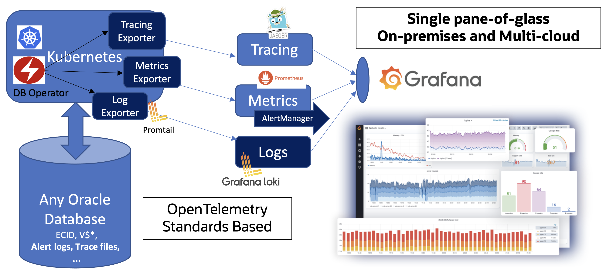
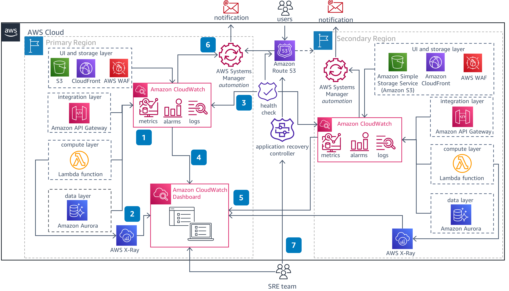
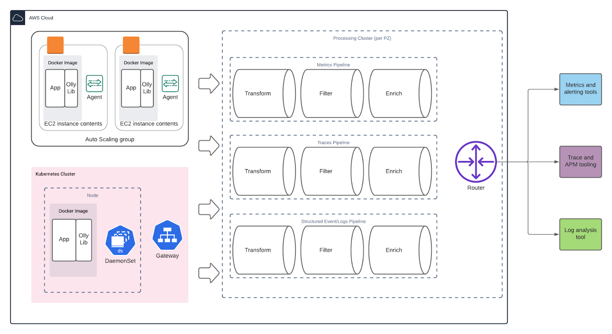
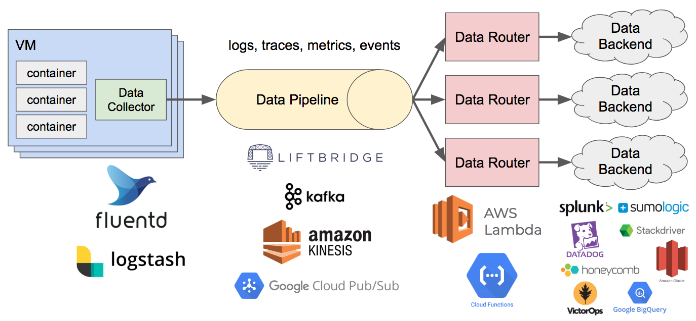
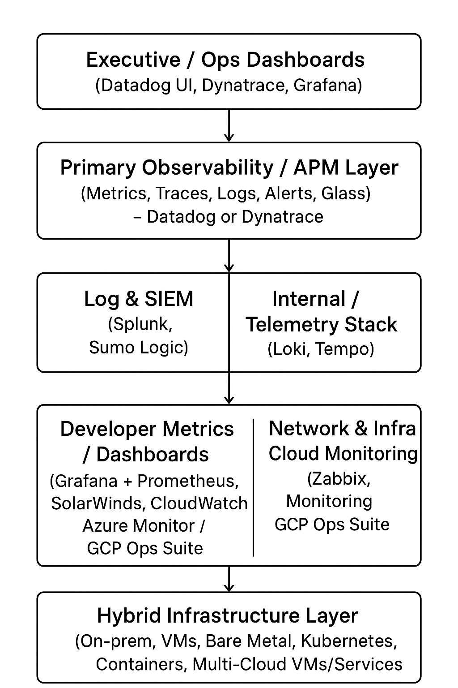
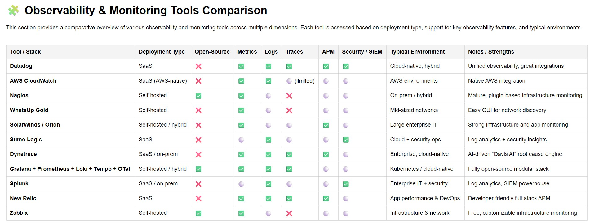
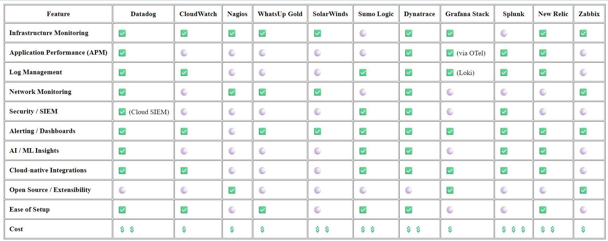
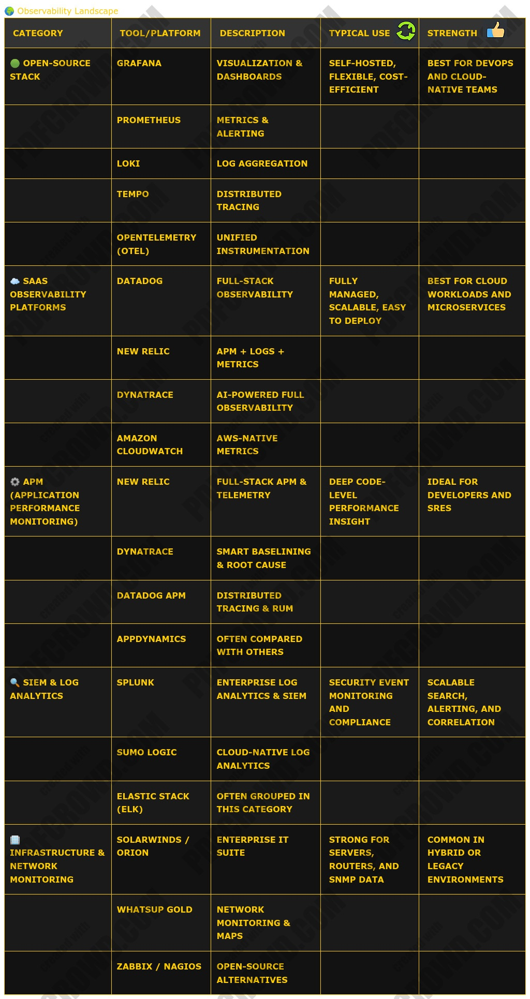

# Monitoring Tools 

### 🧠 Overview

All of these tools deal with observability, which has three pillars:

1. Metrics – numeric measurements over time (CPU, latency, etc.)
2. Logs – textual event records
3. Traces – distributed transaction traces across services

Each tool focuses on one or more of these pillars and may offer alerting, dashboards, and automation.

### 🧩 Detailed Breakdown
#### 1. Datadog
- Type: Cloud-based observability platform (SaaS)
- Features: Metrics, logs, traces, security monitoring, APM, synthetic tests
- Strengths: Easy integrations (AWS, Kubernetes, etc.), great UI, unified observability
- Use case: Cloud-native environments and microservices

#### 2. Amazon CloudWatch

- Type: AWS-native monitoring and logging service
- Features: Collects metrics and logs from AWS resources, creates dashboards, alarms
- Strengths: Tight integration with AWS ecosystem, serverless-ready
- Use case: AWS workloads (EC2, Lambda, ECS, etc.)

#### 3. Nagios
- Type: Open-source monitoring system (mainly infrastructure and services)
- Features: Host/service checks, alerts, plugins, graphing (via add-ons)
- Strengths: Mature, flexible, large plugin ecosystem
- Weakness: Manual setup, less modern UI
- Use case: Traditional IT monitoring (servers, switches, applications)

#### 4. WhatsUp Gold
- Type: Commercial network monitoring tool by Progress Software
- Features: Network device discovery, topology maps, SNMP monitoring, alerts
- Strengths: Easy-to-use GUI, good for mid-sized organizations
- Use case: Network infrastructure monitoring

#### 5. SolarWinds / Orion Platform
- Type: Enterprise IT monitoring suite
- Features: Network, server, application, and database monitoring
- Strengths: Strong for on-premises environments, powerful dashboards
- Note: “Orion” is the underlying platform that unifies SolarWinds modules
- Use case: Large IT infrastructures with mixed environments

#### 6. Sumo Logic
- Type: Cloud-native log analytics and security intelligence platform
- Features: Log aggregation, analytics, dashboards, security insights
- Strengths: SaaS-based, integrates with cloud and CI/CD tools
- Use case: Log analysis and security monitoring (SIEM-lite)

#### 7. Dynatrace
- Type: AI-powered full-stack observability platform
- Features: Metrics, logs, traces, application performance monitoring (APM), infra monitoring
- Strengths: Deep AI correlation (“Davis AI”), auto-discovery of dependencies
- Use case: Enterprise-grade APM and cloud-native observability

#### 8. Grafana + Prometheus + OTel/Loki/Tempo Stack
- Type: Open-source observability stack
- Components:
  - Prometheus → Metrics collection and alerting
  - Grafana → Visualization and dashboards
  - Loki → Log aggregation
  - Tempo → Distributed tracing
  - OpenTelemetry (OTel) → Instrumentation standard for metrics/traces/logs
- Strengths: Open, modular, highly customizable
- Use case: Cloud-native monitoring with open standards

#### 9. Splunk
- Type: Enterprise data analytics and logging platform
- Features: Log ingestion, search (SPL query language), dashboards, SIEM capabilities
- Strengths: Powerful search and analytics, enterprise scalability
- Weakness: Can be expensive
- Use case: Log analytics, security (Splunk Enterprise Security), and compliance

#### 10. New Relic
- Type: Cloud-based APM and observability platform
- Features: Application monitoring, metrics, traces, logs, browser and mobile performance
- Strengths: Developer-friendly, real-time data, modern UI
- Use case: Full-stack observability for DevOps and app teams

#### 11. Zabbix
- Type: Open-source monitoring platform
- Features: Metrics collection via agents, SNMP, dashboards, alerting
- Strengths: Free, scalable, customizable
- Weakness: More complex setup than SaaS tools
- Use case: Infrastructure and network monitoring

##### Here’s a comparative breakdown of the listed tools (Datadog, CloudWatch, Nagios, WhatsUp Gold, SolarWinds/Orion, Sumo Logic, Dynatrace, Grafana+Prometheus+OTel/Loki/Tempo stack, Splunk, New Relic), focusing on their strengths & trade‑offs, and then what would tend to make the “best” choice for a large enterprise that has both multi-cloud and on‑premise needs. If you want, I can also score them (cost, performance, features etc) for your specific constraints.

### 🏗️ Architecture Diagram — Observability in a Hybrid / Multi-Cloud Enterprise
Below is a textual “map” of how the diagram should be structured. Use it as a guide to layout shapes, arrows, and tool icons.

---

---

---

---

---
#### Diagram Layers & Components
# 🧩 Observability & Monitoring Tools Comparison

---

### Legend:
- ✅ = Strong / native support
- ⚪ = Partial / limited support
- ❌ = Not supported

### 🚦 Data Flows / Arrows & Annotations

- Instrumentation / Agents / OpenTelemetry SDKs on apps, services, containers, VMs — these feed metrics, traces, logs into the Primary Observability Layer (Datadog / Dynatrace)
- From the Primary Observability Layer, logs (especially enriched logs) are forwarded or exported into Splunk / Sumo Logic for deep security / compliance / forensic analysis.
- The Internal Telemetry Stack (Prometheus + Loki + Tempo + Grafana) is fed in parallel (via OTLP / exporters) to capture lower-latency, high-resolution metrics/traces for developer-facing dashboards.
- Network / Infra / Device metrics (SNMP, agents, cloud APIs) come from the infrastructure and are ingested both into the Primary Observability platform and optionally into systems like Zabbix / SolarWinds.
- Alerts, notifications, anomaly detection happen in the Primary Observability tool; critical alerts may trigger downstream systems (PagerDuty, Opsgenie).
- Dashboards in the top layer aggregate data surfaces (health status, SLOs) from all subordinate layers for visibility to leadership / operations.

### 🧩 Tool Placement & Relationships
| Layer                       | Key Tools                                                                | Interaction / Integration                                                           |
| --------------------------- | ------------------------------------------------------------------------ | ----------------------------------------------------------------------------------- |
| Primary Observability / APM | **Dynatrace** or **Datadog**                                             | Receives metrics, traces, logs from agents / OTEL; acts as central UI, alert engine |
| Log / SIEM Layer            | **Splunk**, **Sumo Logic**                                               | Logs are forwarded / ingested; correlation, security analytics, alerting            |
| Internal Telemetry Stack    | **Prometheus, Loki, Tempo, Grafana**                                     | High-resolution metrics/tracing, dev dashboards, complement primary tool            |
| Network / Infra Monitoring  | **Zabbix, SolarWinds / Orion, CloudWatch, Azure Monitor, GCP Ops Suite** | Standard infra metrics, SNMP traps, cloud service metrics                           |
| Infrastructure              | On-prem servers, Kubernetes, VMs, Containers, Cloud Services             | Hosts the systems being observed and instrumented                                   |

## Key dimensions to compare

To compare monitoring/observability tools for enterprise + hybrid (multi‑cloud + on‑premise) use, here are the dimensions that matter most:

| Dimension                                                                  | Why it matters in enterprise hybrid & multi‑cloud                                                     |
| -------------------------------------------------------------------------- | ----------------------------------------------------------------------------------------------------- |
| **Coverage** (metrics, logs, traces, events, network, infra, applications) | You want full‑stack observability; missing out on parts causes blind‑spots.                           |
| **Deployment flexibility**                                                 | Can run SaaS, managed cloud, on‑prem, hybrid.                                                         |
| **Scalability & performance**                                              | Large volumes of telemetry; need low latency and ability to scale across regions & clouds.            |
| **Cost structure & predictability**                                        | Many tools charge by host, by volume, by user; unpredictable cost growth is a risk.                   |
| **Ease of use / time to value**                                            | How hard to instrument, configure, integrate, build dashboards, set up alerts.                        |
| **Alerting / Root cause / AIOps**                                          | Automation, anomaly detection, dependency mapping matter.                                             |
| **Security, compliance, data residency**                                   | In regulated industries, on‑prem or specific‑region data storage, audit, encryption etc are required. |
| **Vendor lock‑in & open standards**                                        | Use of open standard telemetry (OpenTelemetry etc) helps portability.                                 |
| **Support, ecosystem, third‑party integrations**                           | Plugins, agents, community, certified integrations.                                                   |

## Comparative analysis

Here’s how each of the tools stacks up approximately on those dimensions:

| Tool                                                                                   | Strengths / Advantages                                                                                                                                                                                           | Weaknesses / Trade‑offs                                                                                                                                                                                                                                                                                                                                                                          |
| -------------------------------------------------------------------------------------- | ---------------------------------------------------------------------------------------------------------------------------------------------------------------------------------------------------------------- | ----------------------------------------------------------------------------------------------------------------------------------------------------------------------------------------------------------------------------------------------------------------------------------------------------------------------------------------------------------------------------------------------------------- |
| **Dynatrace**                                                                          | Very strong full‑stack observability; good at automatic discovery, dependency mapping; strong AI / automation (root cause analysis). Works well in complex environments (multi‑cloud + on‑prem). ([PeerSpot][1]) | Premium cost; complexity in configuration for maximum value; learning curve; some parts may overkill for simpler environments. ([TechRadar][2])                                                                                                                                                                                                                                                  |
| **Datadog**                                                                            | Rich integrations; modular features (APM, logs, infra etc); relatively fast to get going; SaaS model scales; good observability suite. ([PeerSpot][1])                                                           | Can get expensive when scale is large; complexity in cost / licensing; possibly less automatic in dependency mapping vs Dynatrace; managing many agents/configs across on‑prem can add overhead. ([eWeek][3])                                                                                                                                                                                    |
| **Splunk (Enterprise + Cloud)**                                                        | Very powerful search / analytics, strong in log/event volumes, mature product; many enterprise features (security, audit, compliance); can do on‑prem and cloud.                                                 | Historically strong but expensive; licensing cost + infrastructure cost especially on‑prem; sometimes siloed products; search performance / scale must be carefully engineered; vendor can be less nimble.                                                                                                                                                                                       |
| **New Relic**                                                                          | Good at application performance monitoring, trace metrics; user‑friendly dashboards; strong for app‑level telemetry; more modern UX in many cases.                                                               | Log management or “unstructured data” analysis less strong; can be costly (especially per‑user / per‑host); may have limitations in deployment flexibility or data residency; sometimes slower to add enterprise features. ([Sumo Logic][4])                                                                                                                                                     |
| **Sumo Logic**                                                                         | Very good log analytics; cloud‑native, designed for scalability; strong in security/use cases (SIEM etc); more flexible licensing (e.g. ingestion based) in some cases. ([Sumo Logic][4])                        | Might have weaker support in on‑prem / hybrid unless using their connectors; possible delays in real‑time; for some use cases integration / dashboards might require more effort; cost for very large log volumes can still be significant.                                                                                                                                                      |
| **Grafana + Prometheus + OpenTelemetry + Loki + Tempo stack (self‑hosted or managed)** | Very strong open standard / vendor neutral option; high flexibility; “you own your data”; cost can be lower for metrics/tracing if well architected; strong community; you can pick and choose.                  | Requires significant operations overhead: managing storage for metrics, logs, tracing; scaling may be nontrivial; integrations, alerting, user management, data retention/policies etc must be built out; for large enterprise, you need dedicated engineering. Potentially less polished “out of box” in some areas (security, dashboards, alerting, enterprise features) than premium vendors. |
| **Nagios**                                                                             | Very mature, simple concept; lots of plugin support; good for basic infra/network monitoring; low cost of entry; open source / modifiable.                                                                       | Poorer support for modern telemetry (traces etc); config can be static/hard to manage; scaling limitations; UI/UX and advanced features (dependency mapping, anomaly detection, high‑volume logs etc) are weak; maintenance overhead can be high. ([silicloud.com][5])                                                                                                                           |
| **WhatsUp Gold**                                                                       | Good for network / device monitoring; simpler tools; cost‑effective for less complex infrastructure; more limited scope but decent for network infra.                                                            | Not as strong for application performance/tracing; less advanced for logs/traces; scaling & complexity of cloud & microservices less well catered; less “observability” in modern full‑stack sense.                                                                                                                                                                                              |
| **SolarWinds / Orion**                                                                 | Strong traditional network & infrastructure performance monitoring; good for enterprise networks; has detailed features for device/network interface, configuration, etc.                                        | Licenses & maintenance cost can grow; many features are older architecture; may be less suitable for cloud native or microservices / container / tracing heavy setups; can be heavy and complex; vendor issues historically. Also, may have limitations in scaling, flexibility especially across clouds.                                                                                        |
| **CloudWatch (AWS)**                                                                   | Very well integrated into AWS; less overhead if much of infra is in AWS; good metric data; managed, reliable, less ops overhead inside AWS; newer features are improving multi‑cloud or hybrid support.          | If you have many clouds, you may have to stitch together data; exporting logs/traces outside AWS may be harder; costs (ingress, cross‑region, retention) can add up; feature set for on‑prem can be limited; visibility across non‑AWS infrastructure may require extra agents / tools.                                                                                                          |

[1]: https://www.peerspot.com/products/comparisons/datadog_vs_dynatrace?utm_source=chatgpt.com "Datadog vs Dynatrace (2025)"
[2]: https://www.techradar.com/pro/dynatrace-review?utm_source=chatgpt.com "I tried Dynatrace, a comprehensive and advanced observability platform for enterprises"
[3]: https://www.eweek.com/enterprise-apps/dynatrace-vs-datadog/?utm_source=chatgpt.com "Dynatrace vs. Datadog: 2022 Software Comparison | eWEEK"
[4]: https://www.sumologic.com/compare/sumo-logic-vs-new-relic/?utm_source=chatgpt.com "Sumo Logic vs. New Relic | Sumo Logic"
[5]: https://www.silicloud.com/blog/what-are-the-advantages-and-disadvantages-of-nagios-2/?utm_source=chatgpt.com "What are the advantages and disadvantages of Nagios? - Blog - Silicon Cloud"

## What tends to matter most in “enterprise + multi‑cloud + on‑premise”

Given your environment is hybrid: multi‑cloud + on‑prem, as well as enterprise scale, some of the more important criteria would be:

- Ability to ingest telemetry from all your sources: clouds (AWS, Azure, GCP etc), on‑prem servers, network devices, container/kubernetes etc.
- Unified view: metrics + logs + traces, topology (service map) + dependency tracking.
- Data residency / regulatory compliance (some data must remain on‑prem or in specific regions).
- Cost predictability: because as you scale up, ingest more logs/traces etc, cost growth can explode.
- Operational overhead: how much internal effort (setup, maintenance, scaling, upgrading).
- Vendor lock‑in risk. Using open standards helps (OpenTelemetry etc).
- Alerting / diagnosing problems (root cause analysis, anomaly detection) to reduce mean time to resolution.

## Recommendation: Best choice(s) for enterprise hybrid / multi‑cloud

No single tool is perfect; often enterprises use combinations. But if I had to pick one (or a primary + fallback) for your described requirements, here are what I think are the top picks and why, with caveats.

| Top Option                                                                                                        | Why It’s Good                                                                                                                                                                                                                  | Caveats / What You Must Do Well                                                                                                                                                                                                                                                                        |
| ----------------------------------------------------------------------------------------------------------------- | ------------------------------------------------------------------------------------------------------------------------------------------------------------------------------------------------------------------------------ | ------------------------------------------------------------------------------------------------------------------------------------------------------------------------------------------------------------------------------------------------------------------------------------------------------ |
| **Dynatrace**                                                                                                     | Probably the strongest “all‑in one” SaaS/managed platform for large enterprises who want full‑stack observability + automation. If cost is acceptable, you get a lot of capability especially in complex/hybrid environments.  | Budget will be high. You’ll need skilled teams to get full value. Make sure you test support & features in your specific on‑prem & multi‑cloud settings. Also plan for managing agents, data volume, and configuring for cost control.                                                                 |
| **Datadog**                                                                                                       | Very strong too; more modular; easier to adopt parts of it first; good integration ecosystem; good for rapid deployment across multi‑cloud + on‑prem.                                                                          | Again cost can grow; need to manage telemetry volume, avoid surprise billing; may need custom config for dependency mapping etc.                                                                                                                                                                       |
| **Grafana + Prometheus + Loki/Tempo (managed / self‑hosted)** if you have strong platform engineering / SRE teams | If you staff is capable, this gives you great flexibility, avoids vendor lock‑in, can be cost‑efficient at scale (especially metrics, traces). You can also embed open telemetry, control data retention, host where you want. | Requires investment: in building / maintaining the stack, ensuring high availability, scaling storage, building dashboards, handling upgrading; you’ll lose some “out of box” polish. Probably should be used in combination with commercial tools for certain use cases (security, compliance, SLAs). |
| **Sumo Logic** as a strong contender for log & security use cases                                                 | If your logs + security / SIEM are a major concern, Sumo Logic has strengths. Might even use it for security streams, while using another tool for metrics/tracing.                                                            | Need to check how well the tool supports your on‑prem data and regulatory needs; ensure acceptable cost for high log volume.                                                                                                                                                                           |

### 🧭 1. General Overview
| Tool                                       | Type / Focus                                               | Deployment Model    | Best For                                    |
| ------------------------------------------ | ---------------------------------------------------------- | ------------------- | ------------------------------------------- |
| **Datadog**                                | Full-stack observability (APM, infra, logs, RUM, security) | SaaS                | Cloud-native environments, hybrid infra     |
| **CloudWatch**                             | AWS-native monitoring                                      | SaaS (AWS)          | AWS-only workloads                          |
| **Nagios**                                 | Infra & service monitoring                                 | Self-hosted         | On-prem, simple infra monitoring            |
| **WhatsUp Gold**                           | Network monitoring                                         | Self-hosted         | SMBs, traditional IT networks               |
| **SolarWinds / Orion**                     | Network + systems monitoring                               | Self-hosted / SaaS  | Large enterprise networks                   |
| **Sumo Logic**                             | Log management + SIEM + analytics                          | SaaS                | Cloud-native logging and security           |
| **Dynatrace**                              | AI-driven full-stack observability                         | SaaS / On-prem      | Enterprise APM & AI monitoring              |
| **Grafana + Prometheus + OTel/Loki/Tempo** | Open-source observability stack                            | Self-hosted / Cloud | DIY observability, flexible environments    |
| **Splunk**                                 | Logs + analytics + SIEM + observability                    | SaaS / Self-hosted  | Enterprises, security & analytics-heavy use |
| **New Relic**                              | Unified observability (APM, infra, logs)                   | SaaS                | Cloud-native and DevOps teams               |
| **Zabbix**                                 | Infra & network monitoring                                 | Self-hosted         | On-prem, cost-sensitive users               |

### 🔍 2. Feature Comparison Summary

##### ✅ = Strong support ⚪ = Partial 💲 = Relative cost indicator

### 🧠 3. Strengths & Weaknesses
| Tool                 | Strengths                                    | Weaknesses                                               |
| -------------------- | -------------------------------------------- | -------------------------------------------------------- |
| **Datadog**          | Unified platform, 600+ integrations, good UX | Can become costly at scale                               |
| **CloudWatch**       | Tight AWS integration, easy setup            | Weak UX, expensive logs, AWS-only                        |
| **Nagios**           | Simple, stable, customizable                 | Outdated UI, limited scalability                         |
| **WhatsUp Gold**     | Network visualization, simple setup          | Limited for cloud & containers                           |
| **SolarWinds/Orion** | Deep network insight, mature                 | Heavy footprint, costly, 2020 security breach reputation |
| **Sumo Logic**       | Great for logs, compliance/SIEM              | Complex pricing, less infra visibility                   |
| **Dynatrace**        | AI-powered automation, strong APM            | Expensive, complex setup                                 |
| **Grafana Stack**    | Open-source, modular, flexible               | DIY setup & maintenance overhead                         |
| **Splunk**           | Best-in-class search, analytics, SIEM        | Very expensive, high resource use                        |
| **New Relic**        | Unified telemetry, good pricing model        | Learning curve, occasional UI lag                        |
| **Zabbix**           | Free, reliable, customizable                 | Manual setup, lacks APM/log depth                        |

### ⚙️ 4. Best Fit by Use Case
| Use Case                                               | Recommended Tools                              |
| ------------------------------------------------------ | ---------------------------------------------- |
| **Cloud-native / Kubernetes monitoring**               | Datadog, Dynatrace, Grafana Stack, New Relic   |
| **AWS-only environments**                              | CloudWatch                                     |
| **On-prem infrastructure monitoring**                  | Zabbix, Nagios, SolarWinds, WhatsUp Gold       |
| **Network-centric monitoring**                         | SolarWinds, WhatsUp Gold, Zabbix               |
| **Log management & analytics**                         | Splunk, Sumo Logic, Grafana Loki, Datadog Logs |
| **Full observability (infra + APM + logs + security)** | Datadog, Dynatrace, New Relic                  |
| **Budget-conscious open source**                       | Grafana Stack, Zabbix, Nagios                  |
| **Enterprise compliance/SIEM**                         | Splunk, Sumo Logic, Datadog Security           |

### 📊 5. Observability Tool Comparison Matrix
| Tool                                       | Infra Monitoring | APM | Log Mgmt | Network Monitoring | Cloud-Native / DevOps | AI / ML Insights | Ease of Use | Cost Efficiency | Open Source / Flexibility | **Overall Score** |
| ------------------------------------------ | ---------------- | --- | -------- | ------------------ | --------------------- | ---------------- | ----------- | --------------- | ------------------------- | ----------------- |
| **Datadog**                                | 5                | 5   | 5        | 4                  | 5                     | 5                | 5           | 3               | 3                         | **40 / 45**       |
| **AWS CloudWatch**                         | 4                | 3   | 4        | 2                  | 5                     | 2                | 4           | 3               | 2                         | **29 / 45**       |
| **Nagios**                                 | 4                | 2   | 2        | 4                  | 2                     | 1                | 3           | 5               | 4                         | **27 / 45**       |
| **WhatsUp Gold**                           | 4                | 1   | 1        | 5                  | 2                     | 1                | 4           | 4               | 2                         | **24 / 45**       |
| **SolarWinds / Orion**                     | 5                | 3   | 3        | 5                  | 3                     | 2                | 3           | 2               | 2                         | **28 / 45**       |
| **Sumo Logic**                             | 3                | 3   | 5        | 2                  | 4                     | 4                | 4           | 3               | 2                         | **30 / 45**       |
| **Dynatrace**                              | 5                | 5   | 4        | 4                  | 5                     | 5                | 4           | 2               | 2                         | **36 / 45**       |
| **Grafana + Prometheus + OTel/Loki/Tempo** | 5                | 4   | 4        | 3                  | 5                     | 3                | 3           | 5               | 5                         | **37 / 45**       |
| **Splunk**                                 | 3                | 4   | 5        | 2                  | 4                     | 4                | 3           | 1               | 2                         | **28 / 45**       |
| **New Relic**                              | 5                | 5   | 4        | 3                  | 5                     | 4                | 4           | 3               | 3                         | **36 / 45**       |
| **Zabbix**                                 | 5                | 2   | 2        | 5                  | 2                     | 1                | 3           | 5               | 4                         | **29 / 45**       |

### 🏆 6. Category Leaders
| Category                                          | Leader(s)                                  | Notes                                                     |
| ------------------------------------------------- | ------------------------------------------ | --------------------------------------------------------- |
| **Best Overall Observability**                    | 🥇 Datadog, 🥈 Dynatrace, 🥉 Grafana Stack | Datadog is strongest SaaS; Grafana Stack best open-source |
| **Best for Logs**                                 | Splunk, Sumo Logic, Datadog                | Splunk for enterprise scale, Sumo for SaaS simplicity     |
| **Best APM (Application Performance Monitoring)** | Dynatrace, Datadog, New Relic              | Deep insights with automation and trace visualization     |
| **Best Open Source / DIY**                        | Grafana Stack, Zabbix, Nagios              | Great for budget and control; requires more setup         |
| **Best for AWS Users**                            | CloudWatch, Datadog                        | CloudWatch native, Datadog offers richer visualization    |
| **Best Network Monitoring**                       | SolarWinds, WhatsUp Gold, Zabbix           | Deep SNMP/device-level visibility                         |
| **Best Value for Cost**                           | Zabbix, Nagios, Grafana Stack              | Low to no license fees, high configurability              |
| **Most AI-Driven Insights**                       | Dynatrace, Datadog                         | Strong anomaly detection and root-cause analysis          |

### 🧠 7. Quick Summary by Persona
| Persona                      | Best Tools                        | Why                                        |
| ---------------------------- | --------------------------------- | ------------------------------------------ |
| **Cloud DevOps / SRE**       | Datadog, Grafana Stack, New Relic | Unified observability & integrations       |
| **Enterprise IT Operations** | Dynatrace, SolarWinds, Splunk     | APM, network + security visibility         |
| **Security / Compliance**    | Splunk, Sumo Logic, Datadog       | SIEM + observability integration           |
| **On-Premise Admins**        | Zabbix, Nagios, SolarWinds        | SNMP, low cost, agent-based monitoring     |
| **Cost-Conscious Teams**     | Grafana Stack, Zabbix             | Open source, scalable, customizable        |
| **AWS-Only Shops**           | CloudWatch, Datadog               | Seamless integration with AWS metrics/logs |

  
### 🏢 Recommended Observability Strategy for a Large Hybrid (On-Prem + Multi-Cloud) Enterprise
#### 1. Primary Observability Platform (APM + Infra + Logs + Alerts)

###### → Dynatrace or Datadog
- Dynatrace
  - Best choice if the enterprise values AI-assisted root cause, auto-dependency mapping (Smartscape), and strong automation for large, complex environments.
  - Slightly steeper cost and setup curve, but long-term operational efficiency and reduced noise make it worthwhile in large, dynamic environments.

- Datadog
  - Excellent balance of speed, flexibility, and ecosystem coverage.
  - Easier to roll out across diverse hybrid systems (VMs, containers, serverless, etc.).
  - Better integration breadth (600+ integrations), strong community and rapid innovation cadence.
  - Usually faster to implement and train teams on compared to Dynatrace.

###### 👉 Choose one as your “source of truth” for unified metrics, traces, logs, dashboards, and alerting.

#### 2. Log-Heavy, Compliance, and Security Use Cases

###### → Splunk or Sumo Logic

- Splunk
  - Most mature platform for log analytics, SIEM, and compliance (PCI, SOX, etc.).
  - Great for security operations, audit, and threat detection.
  - However, very expensive at scale — both in licensing and infrastructure (for self-managed).
  - Still often the default in large regulated enterprises.

- Sumo Logic
  - Lighter-weight SaaS alternative that provides solid log analytics + basic SIEM.
  - Easier management and cost model, though not as deep or extensible as Splunk.
  - Works very well in multi-cloud contexts.

###### 👉 Consider integrating your APM platform (Datadog or Dynatrace) with one of these log/SIEM systems for end-to-end visibility and security monitoring.

#### 3. Open Telemetry & Internal Metrics Stack (Optional / Complementary)

###### → Grafana + Prometheus + Loki + Tempo

- Ideal for **developer-facing dashboards, performance metrics, and cost control.**
- Can be self-hosted or managed (Grafana Cloud, Amazon Managed Prometheus, etc.).
- Use OpenTelemetry for standardized data collection — gives flexibility to send telemetry to either your open stack or the commercial platform.
- Great for latency-sensitive internal metrics, R&D environments, and long-term historical data retention (cheaper than commercial storage).

###### 👉 Don’t try to replace your enterprise-grade platform entirely — use this stack alongside it for cost and flexibility.

#### 4. Network and Infrastructure Monitoring (Complementary)

###### → SolarWinds / Orion, WhatsUp Gold, or Zabbix

- **SolarWinds** and **WhatsUp Gold** remain strong for traditional SNMP-based network and device monitoring.
- **Zabbix** offers a free, open-source option for on-premise environments with customizable dashboards and alerts.
- Integrate key metrics/events into your central observability tool (Datadog/Dynatrace) to maintain a unified view.

##### 5. Cloud-Native Integrations

- **CloudWatch (AWS), Azure Monitor**, and **GCP Operations Suite** should still be used for native metrics/log collection and autoscaling hooks.
- Feed those metrics into the main observability tool to avoid silos.
- Cloud-native monitoring tools can remain the “first mile” for data collection, but not the main observability front-end.

##### 6. Governance, Cost, and Data Hygiene

To keep the ecosystem sustainable and efficient:

- **Define observability tiers** (e.g., Tier 1 critical services get full tracing; Tier 3 gets metrics only).
- **Set clear data retention and sampling policies** — don’t collect 100% of traces/logs unless justified.
- **Centralize alerting** with escalation paths and severity levels.
- **Monitor observability costs** like any other cloud workload; telemetry can quietly become a large budget line.
- **Ensure data residency & compliance** controls are applied across all tools (esp. for EU, Gov, or healthcare data).

## My suggestion

- Given all that, for a large enterprise with hybrid on‑prem + multi‑cloud, here is what I'd probably propose:
- Use Dynatrace or Datadog as the primary observability tool (metrics + traces + logs + dashboards + alerting). If cost allows, Dynatrace has edge in automation & root cause, but Datadog may give more flexibility & faster ramp.
- For log‑heavy and security / compliance / SIEM use cases, consider Sumo Logic or Splunk. Splunk is more mature and very feature rich, but cost & management overhead are larger. Sumo Logic may hit sweet spot if you can accept the limitations.
- Optionally run an open telem‑stack (Prometheus + Grafana + Loki + Tempo) in a managed fashion for internal telemetry (e.g. performance metrics, developer dashboards) where latency matters, and possibly for cost containment. Use it alongside the commercial tool, not necessarily fully replacing it.
- Be sure to build out good governance around how much telemetry is collected, retention policies, alerting thresholds, data residency, etc., so you don’t get huge bills and unwieldy data.

### 🧾 1.  Summary Recommendation

- Best All-Rounder (Cloud-native) → Datadog
- Most Comprehensive Enterprise APM → Dynatrace
- Best Open Source Stack → Grafana + Prometheus + OTel/Loki/Tempo
- Best for Logs & Security Analytics → Splunk or Sumo Logic
- Most Affordable On-Prem → Zabbix or Nagios
- Best for AWS-native users → CloudWatch

### 🧭 2. Observability & Monitoring Tools Landscape

| **Category**                                | **Tool/Platform**                               | **Description**                                    | **Typical Use**                                    | **Strength**                                             |
|--------------------------------------------|-------------------------------------------------|----------------------------------------------------|----------------------------------------------------|----------------------------------------------------------|
| 🌍 **OBSERVABILITY LANDSCAPE**              |                                                 |                                                    |                                                    |                                                          |
| **🟢 OPEN-SOURCE STACK**                    |                                                 |                                                    | Cloud-native observability, self-managed          | Open standards, extensible, cost-effective               |
|                                            | **Grafana**                                     | Visualization & dashboards                         |                                                    |                                                          |
|                                            | **Prometheus**                                  | Metrics collection & alerting                      |                                                    |                                                          |
|                                            | **Loki**                                        | Log aggregation (by Grafana Labs)                  |                                                    |                                                          |
|                                            | **Tempo**                                       | Distributed tracing (by Grafana Labs)              |                                                    |                                                          |
|                                            | **OpenTelemetry (OTel)**                        | Instrumentation standard                           |                                                    |                                                          |
|                                            | **Zabbix**                                      | Infrastructure monitoring                          |                                                    |                                                          |
|                                            | **Nagios**                                      | Plugin-based IT monitoring                         |                                                    |                                                          |
| **☁️ SAAS & CLOUD-NATIVE OBSERVABILITY PLATFORMS** |                                                 |                                                    | Cloud & Kubernetes environments                    | Quick setup, automatic integrations, scalability         |
|                                            | **Datadog**                                     | Unified metrics, logs, traces, security            |                                                    |                                                          |
|                                            | **New Relic**                                   | Full-stack APM and telemetry                       |                                                    |                                                          |
|                                            | **Dynatrace**                                   | AI-driven observability (“Davis AI”)               |                                                    |                                                          |
|                                            | **Amazon CloudWatch**                           | AWS-native monitoring & logging                    |                                                    |                                                          |
| **🏢 ENTERPRISE IT MONITORING SUITES**       |                                                 |                                                    | On-premises or hybrid enterprise networks          | Broad infrastructure coverage, legacy-friendly          |
|                                            | **SolarWinds / Orion Platform**                 | Deep network & server visibility                   |                                                    |                                                          |
|                                            | **WhatsUp Gold**                                | Network discovery and SNMP monitoring              |                                                    |                                                          |
| **🔍 LOG ANALYTICS & SECURITY (SIEM FOCUS)** |                                                 |                                                    | Security monitoring, compliance, log analysis     | Scalable search, correlation, and alerting              |
|                                            | **Splunk**                                      | Enterprise log analytics & SIEM                    |    Security, compliance, event correlation           |    Best for SOCs and incident response teams                                  |
|                                            | **Sumo Logic**                                  | Cloud-native log and security analytics            |                                                    |                                                          |
|                                            | **Elastic Stack (ELK)**                               | Often grouped in this category                        |                                                     |                                                      |
| **⚙️ HYBRID & INTEGRATED ENVIRONMENTS**     |                                                 |                                                    | Enterprises moving from legacy to cloud-native     | Flexibility, vendor-neutral observability layer         |
|                                            | **Combination**                                 | Open-source (Grafana/Prometheus) with SaaS tools    |                                                    |                                                          |
|                                            | **OpenTelemetry Integration**                   | Instrument apps → send data to Datadog, Splunk, etc. |                                                    |                                                          |
|                                            | **Typical Mix**                                 | AWS CloudWatch + Grafana + Splunk integration      |                                                    |                                                          |
| **⚙️ APM (APPLICATION PERFORMANCE MONITORING)** |                                           |                                                       | Deep code-level performance insight                 | Ideal for developers and SREs                        |
|                                            | **New Relic**                                          | Full-stack APM & telemetry                             |                                                     |                                                      |
|                                            | **Dynatrace**                                          | Smart baselining & root cause                         |                                                     |                                                      |
|                                            | **Datadog APM**                                        | Distributed tracing & RUM                             |                                                     |                                                      |
|                                            | **AppDynamics**                                        | Often compared with others                            |                                                     |                                                      |
| **🏢 INFRASTRUCTURE & NETWORK MONITORING**  |                                                        |                                                       | Strong for servers, routers, and SNMP data          | Common in hybrid or legacy environments              |
|                                            | **SolarWinds / Orion**                                | Enterprise IT suite                                   |                                                     |                                                      |
|                                            | **WhatsUp Gold**                                       | Network monitoring & maps                             |                                                     |                                                      |
|                                            | **Zabbix / Nagios**                                    | Open-source alternatives                              |                                                     |                                                      |

### 🧠  Key Insights

- Open-source tools (Grafana stack, Zabbix, Nagios) → best for flexibility and cost control.
- SaaS tools (Datadog, Dynatrace, New Relic) → best for speed, simplicity, and scaling with cloud.
- Enterprise IT tools (SolarWinds, WhatsUp Gold) → ideal for legacy + network-heavy environments.
- Log/SIEM tools (Splunk, Sumo Logic) → focus on log analytics, compliance, and security insights.
- Hybrid approach → most organizations blend these layers for complete observability.

   
───────────────────────────────────────────────────────────────

   🌐 **HYBRID ECOSYSTEM TREND**
   ──────────────────────────────
   → Combine OpenTelemetry for standard instrumentation  
   → Send data to both open-source (Grafana stack) and SaaS (Datadog / Splunk) backends  
   → Use CloudWatch or Azure Monitor for native cloud metrics  
   → Visualize everything in Grafana or vendor dashboards  

───────────────────────────────────────────────────────────────

   🧠 **At a Glance**
   ──────────────────────────────
   | Category             | Example Tools                | Focus Area                  |
   |-----------------------|------------------------------|-----------------------------|
   | Open Source           | Grafana, Prometheus, Loki    | DIY Observability Stack     |
   | SaaS Observability    | Datadog, New Relic, Dynatrace| Unified Cloud Observability |
   | APM                  | New Relic, Datadog, Dynatrace| Application Performance     |
   | SIEM / Log Analytics | Splunk, Sumo Logic           | Security, Logs, Compliance  |
   | Infra Monitoring     | SolarWinds, WhatsUp Gold     | Networks, On-prem Systems   |

### 3. Summary Architecture Example

| **Category**                                   | **Tool/Platform**                             | **Description**                             | **Typical Use**                            | **Strength**                                 |
|------------------------------------------------|----------------------------------------------|---------------------------------------------|--------------------------------------------|---------------------------------------------|
| **Executive / Ops Dashboards**                 | **Grafana / Datadog / Dynatrace**             | Unified observability dashboards            | Real-time performance and health monitoring | Comprehensive views across multiple domains |
| **Application Metrics**                        | **Prometheus**                               | Metrics collection and alerting             | Application and infrastructure metrics     | Scalable, time-series based monitoring      |
| **Traces**                                     | **OpenTelemetry (OTel)**                     | Distributed tracing                         | Application performance and root cause analysis | Open standard, vendor-neutral               |
| **Logs**                                       | **Loki**                                     | Log aggregation                             | Centralized log management and querying    | Efficient, cost-effective log storage       |
| **Security Events**                            | **Splunk / Sumo Logic**                      | Enterprise-level SIEM                       | Security event monitoring and compliance   | Scalable search, alerting, and correlation  |
| **Cloud-Native Metrics**                       | **CloudWatch / AzureMon**                    | Cloud-native monitoring                     | Cloud infrastructure and application monitoring | Seamless integration with cloud providers  |
| **Network / Infra Metrics**                    | **Zabbix / SolarWinds**                      | Infrastructure and network monitoring       | Servers, routers, and network devices      | Broad support for various devices and protocols |
| **Alerts**                                     | **PagerDuty / Opsgenie**                     | Incident management and alerting            | Critical alert notifications               | Real-time, actionable alerting              |
| **On-Prem / Cloud Workloads / Kubernetes / VMs**| **Combined Stack**                           | Full observability stack (e.g., Grafana + Prometheus + CloudWatch) | Hybrid or cloud-native environments        | Flexibility, cross-platform integration     |

### ✅ 4. Final Recommendation Summary
| Purpose                                | Recommended Tool(s)                                           |
| -------------------------------------- | ------------------------------------------------------------- |
| **Primary Observability (Full Stack)** | Dynatrace or Datadog                                          |
| **Log Analytics / SIEM**               | Splunk (enterprise), Sumo Logic (lean SaaS)                   |
| **Internal / Developer Metrics**       | Grafana + Prometheus + Loki + Tempo                           |
| **Network / Device Monitoring**        | SolarWinds, WhatsUp Gold, or Zabbix                           |
| **Cloud Provider Native Telemetry**    | CloudWatch, Azure Monitor, GCP Ops Suite                      |
| **Governance & Cost Control**          | Implement data retention, sampling, and alert tuning policies |

### 5. 📊 Quick Comparison Summary
| Tool / Stack         | Type        | Strengths                   | Common Use Case               |
| -------------------- | ----------- | --------------------------- | ----------------------------- |
| **Datadog**          | SaaS        | Unified metrics/logs/traces | Cloud-native monitoring       |
| **CloudWatch**       | AWS-native  | Deep AWS integration        | AWS-only workloads            |
| **Nagios**           | Open-source | Mature, extensible          | Traditional IT systems        |
| **WhatsUp Gold**     | Commercial  | Easy setup                  | Network monitoring            |
| **SolarWinds Orion** | Enterprise  | Deep visibility             | Large hybrid IT               |
| **Sumo Logic**       | SaaS        | Log & security analytics    | Cloud + DevOps                |
| **Dynatrace**        | SaaS        | AI-driven observability     | Enterprise APM                |
| **Grafana Stack**    | Open-source | Modular, open standards     | Cloud-native observability    |
| **Splunk**           | Enterprise  | Log analytics, SIEM         | Large-scale security + IT ops |
| **New Relic**        | SaaS        | Full-stack APM              | DevOps, app performance       |
| **Zabbix**           | Open-source | Free, customizable          | Infrastructure monitoring     |

#### 6. 🧠 Categorization by Focus
| Category                                         | Tools                                        |
| ------------------------------------------------ | -------------------------------------------- |
| **Full Observability (metrics + logs + traces)** | Datadog, Dynatrace, New Relic, Grafana Stack |
| **Mainly Logs & Security (SIEM focus)**          | Splunk, Sumo Logic                           |
| **Infrastructure / Network Monitoring**          | Nagios, Zabbix, WhatsUp Gold, SolarWinds     |
| **Cloud-Native or Vendor-Specific**              | CloudWatch (AWS), Datadog, Grafana Stack     |
| **Enterprise APM Leaders**                       | Dynatrace, New Relic, Datadog                |

   
