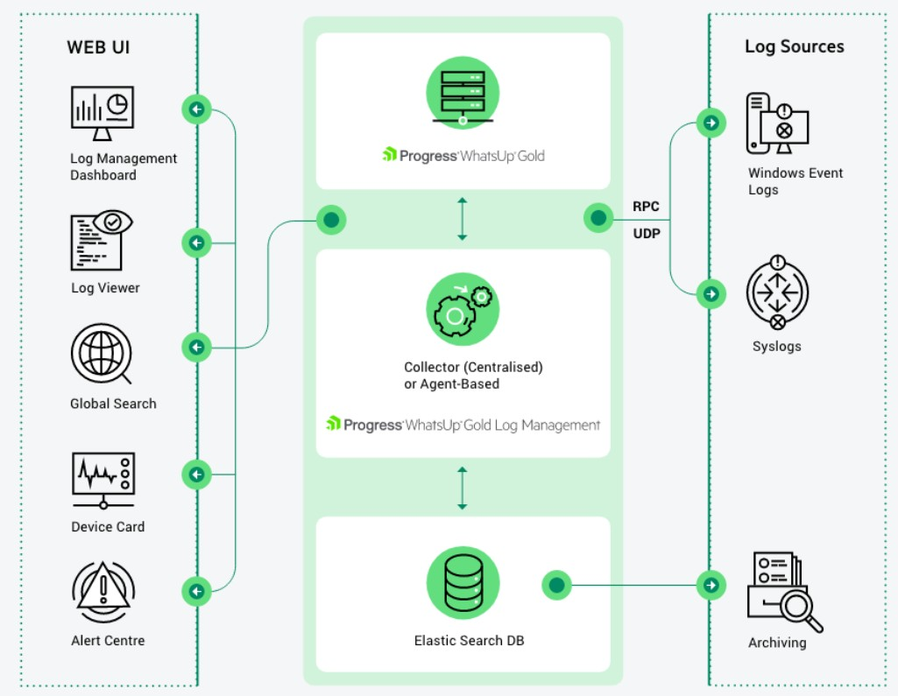

# WhatsUp Gold Monitoring Tools 

## Simple, Integrated Log Management & Archiving
- **WhatsUp Gold Log Management provides easy visibility and management of device log data – all integrated into an easy-to-use, industry-leading interface. You can monitor, filter, search and alert on syslogs or Windows logs for every device in your network while also watching for meta trends like log volume changes. You can archive logs to any storage locations for any retention period to comply with regulatory requirements and preserve historical data.**

### Network Availability and Performance Monitoring
- **WhatsUp Gold is a comprehensive set of network monitoring tools designed for both on-premises and cloud environments.**

---

## Intelligent IT Infrastructure Monitoring with WhatsUp Gold

---

### More Than Just Network Monitoring Software
##### Discover Your Network
- **WhatsUp Gold’s powerful layer 2/3 discovery results in a detailed interactive map of your entire networked infrastructure. Monitor and map everything from the edge to the cloud including devices, wireless controllers, servers, virtual machines, applications, traffic flows and configurations across Windows, LAMP and Java environments.**

---

##### Get Real-time Alerts
- **Ensure optimal performance and availability to meet or beat SLAs. Manage networks, traffic, physical servers, VMs and applications with easy-to-use and customizable maps, dashboards and alerts. Click on any device in WhatsUp Gold to get immediate access to a wealth of related network monitoring settings and reports.**

---

##### Resolve Issues Quickly
- **Intuitive workflows and easy customization help you reduce MTTRs. WhatsUp Gold streamlines network monitoring workflows by letting you initiate management tools directly from the interactive map. Easily switch between physical, virtual, wireless and dependency views to resolve issues quickly.**

---

#### Discover, Map and Monitor Your Network Devices in Minutes with the Network Discovery Tool by WhatsUp Gold
- **Discover everything connected to your network from devices, servers, deployed software, Windows, wireless and virtual infrastructures and more. The WhatsUp Gold's Network Discovery Tool features powerful Layer 2/3 discovery which can be initiated from an IP Range Scan or SNMP Smart Scan of a core router’s Bridge Table to generate a detailed map of your network from top to bottom - so you can focus on keeping it running securely and at peak performance.**
  - Map, inventory, and visualize your network topology and interdependencies
  - Document and track all your IT assets with enhanced inventory discovery
  - Troubleshoot connectivity issues with Layer 2 Trace and IP/ Mac Finder tools
  
### Discover Devices On Your Network
- **The WhatsUp Gold's Network Discovery Software uses a number of innovative Layer 2/3 discovery technologies - including ARP, SNMP, SSH, Virtual Infrastructure Management, IP addressing, ICMP and LLDP in combination with vendor-proprietary mechanisms - to discover everything connected to your network and build a complete and accurate picture of network devices and their port-to-port connectivity.. Full or partial discoveries can be scheduled to run automatically or run on-demand.**

---

### Visualize with Network Maps
- **The WhatsUp Gold Network Discovery Tool auto-generates integrated Layer 2 and 3 network maps that give you full visibility into physical, logical, and virtual connectivity, including IP and VLAN-specific information. It dynamically updates its maps as changes occur in the network. Maps are easy to customize and manipulate so you can view your network the way you want.**

---

### Assign Device Roles and Dependencies
- **At the completion of the discovery process, WhatsUp Gold automatically assigns devices roles that specify what data to collect and remedial actions that are enabled. You can easily modify default device roles and sub-roles or create new ones with the Device Role Editor. The automated network discovery process also identifies dependencies that are marked on the map as directional arrows. With a couple of mouse clicks, dependency data can be used to suppress unnecessary alerts saving valuable troubleshooting time by minimizing false alerts.**

###  Maintain an Accurate Network Inventory
- **WhatsUp Gold provides comprehensive network inventory and configuration information – supporting the reporting/ documentation needs of your internal business process (such as ITIL) and regulatory requirements like PCI DSS, SOX, FISMA and HIPAA. Since you can easily export this information in CSV or Excel formats, your entire team will know exactly what resources are on your network, where they are and how they are connected at all times – even when your network grows, your office moves or datacenter resources get consolidated.**

### Manage Your Network Assets
- Gather, filter and export a wide variety of inventory and configuration information across networking devices and systems.
  - Networking Devices Asset Information: Manufacturer/Model, Serial Number, Hardware/Software/ Firmware Versions, Chassis/Module Inventory, Power Supplies/Fans
  - Configuration Information: Interfaces, Bridge Ports, Switch Ports, VLANs
  - Systems Inventory: All available system component details (CPU, RAM, disks, etc.), OS version & patch information, any installed software packages, support for automatic update of warranty information (Dell and HP) based on integration with their support websites

#### Network Traffic Analysis (NTA)
- **Obtain real-time visibility into network traffic to detect and analyze ongoing issues, minimizing downtime and allowing faster response to performance bottlenecks with WhatsUp Gold’s network monitoring software.**

#### Integrate and Automate with REST API
- **The new WhatsUp Gold REST API offers a powerful suite of calls that let you integrate network monitoring data with other systems and also let you automate a broad range of network monitoring tasks such as adding and removing devices.**

## WhatsUp Gold Add-On Modules
- **These add-on modules integrate seamlessly with WhatsUp Gold to extend the core IT infrastructure monitoring capabilities.**

##### Network Traffic Analysis
- **Network Traffic Analysis delivers detailed and actionable data on network traffic and bandwidth consumption. The WhatsUp Gold NTA module not only monitors overall bandwidth utilization, but also indicates which users, applications, and protocols are consuming the most bandwidth. It supports a wide variety of flow protocols including NetFlow, NSEL, QUIC, sFlow, J-Flow and IPFIX.**

##### Application Performance Monitoring
- **The APM module extends the visibility of WhatsUp Gold to monitor the performance of mission-critical applications like Exchange, SQL Server®, SharePoint®, Dynamics, DNS, IIS, Active Directory®, Hyper-V® and more. Customize definitions of application states and how SLAs are calculated to eliminate false SLA failures.**

##### Log Management
- **WhatsUp Gold Log Management brings device log information to your fingertips. You can gather Windows event logs & syslogs, control and/or visualize them from the map or customizable dashboards and trigger alerts on specified conditions. Configure log searches and export the results automatically or on demand. Archive logs for regulatory compliance or to preserve historic data. Simplify your life when logs become part of your network issue diagnosis process.**

##### Configuration Management
- **WhatsUp Gold’s Network Configuration Management module automates the configuration and change management for routers, switches and firewalls on your network. Archive and audit network configurations and get alerted to configuration changes. Reduce errors and support compliance requirements for HIPAA, SOX, FISMA and PCI DSS and other regulations.**

##### Virtualization Monitoring
- **Virtualization Monitoring is an add-on module that adds the capability to discover, map, monitor, alert and report on both small virtual environments and entire data centers.**
